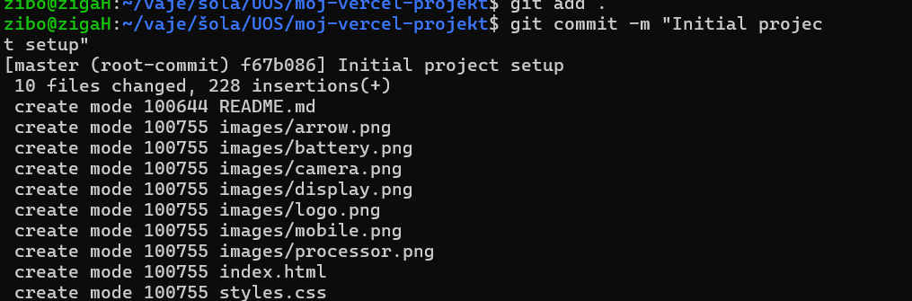
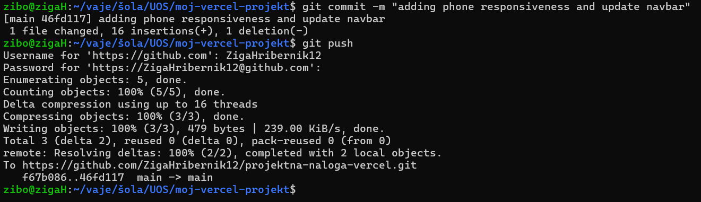
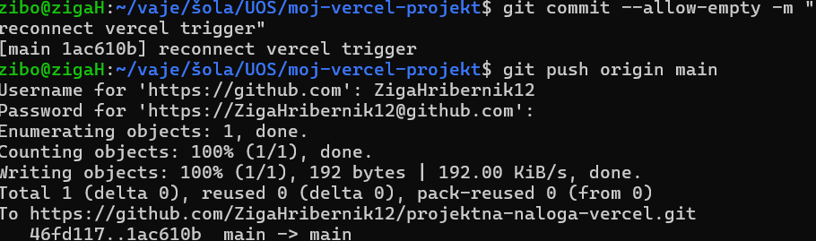
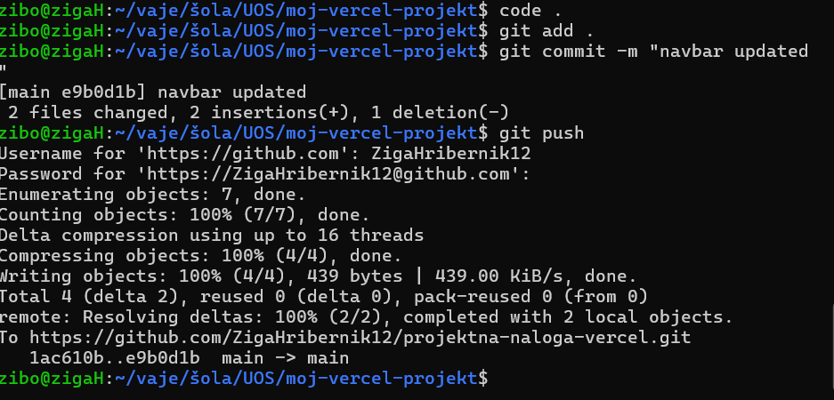
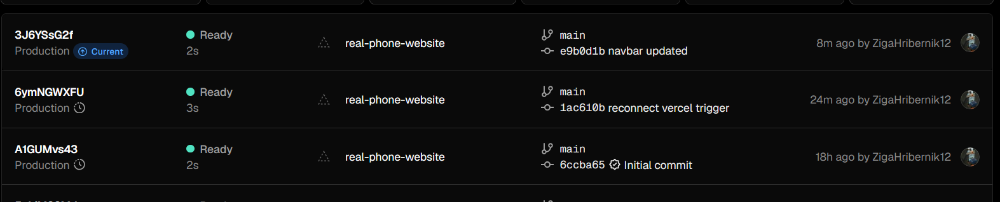
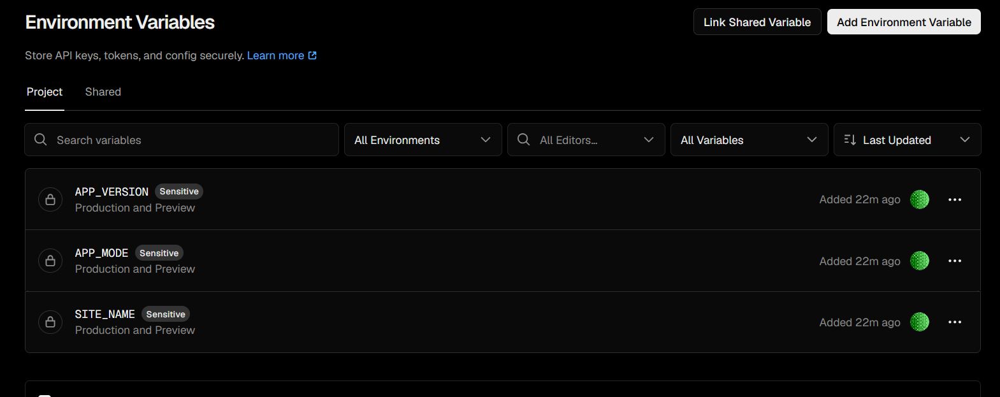

# Projektna-naloga-vercel

## Opis
Napisal sem preprosto statično spletno stran real-phone-website z html,css in javascriptom jo dodal v github repo ki sem ga povezal z vercelom in na vercelu deployal,
kodo sem večkrat spremenil da sem testiral in commital spremembe,da sem videl če avtomatski CI/CD na vercelu deluje.

## Uporabljene tehnologije
- HTML
- CSS
- JavaScript
- GitHub
- Vercel
- Cloudflare ali Supabase

## Deploy 
Vercel Production URL:
https://real-phone-website.vercel.app/

## Screenshot dokuementacija

prvi-commit

drugi-commit

tretji-commit

četrti-commit

Vercel deployments

Enviromental-variables

## CI/CD
Samodejni deploy se izvede,ko narediš spremembo v kodi in želiš da se samodejno sprememba kode samodejno objavi in deploya na vercelu torej z ukazi git add. in git commit in git push se morajo
spremembe samodejno shraniti v vercelu.

## Dodatna konfiguracija
Dodane so bile environment variables v Vercel:

SITE_NAME = Real Phone Website  
APP_VERSION = 1.0  
APP_MODE = production  

Environment variables omogočajo konfiguracijo aplikacije brez spreminjanja kode.

## Težave
Največje težave sem imel pri CI/CD,namreč 2.commit se mi pospremembah ni hotel avtomatsko deployati v vercelu kjer sem moral prekiniti povezavo z gitom in nato ponovno povezati zatem pa sem ponovno commital z ukazom z ukazom  --allow-empty -m 

## Vprašanja za razmislek
### Kaj pomeni CI/CD?
Ko spremeniš kodo, se aplikacija sama testira in objavi.
### Kaj se zgodi, ko naredite git push?
koda se pošlje na GitHub,zazna spremembo,če je vercel povezan dobi signal in avtomatski naredi nov deploy.
### Kakšna je razlika med Preview in Production deployem?
Preview deploy je testna verzija, Production deploy pa uradna verzija spletne strani.
### Zakaj je koristno uporabljati GitHub skupaj z Vercelom?
GitHub in Vercel skupaj omogočata avtomatsko objavo spletne strani ob spremembah kode.
### Kaj so environment variables?
Environment variables so skrivni podatki (npr. API ključi), ki niso vidni v kodi.
### Zakaj DNS konfiguracija spada med pomembne sistemske naloge?
DNS poveže domeno z ustreznim strežnikom
### Kakšna so varnostna tveganja, če je Supabase tabela javno zapisljiva?
Če je Supabase tabela javno zapisljiva, lahko kdorkoli spreminja podatke, kar je varnostno tveganje. Produkcijska aplikacija potrebuje varnost, avtentikacijo, zaščito podatkov, monitoring in optimizacijo.
### Kaj bi bilo treba dodati, če bi projekt postal produkcijska aplikacija?
Produkcijska aplikacija potrebuje varnost, avtentikacijo, zaščito podatkov, monitoring in optimizacijo.

